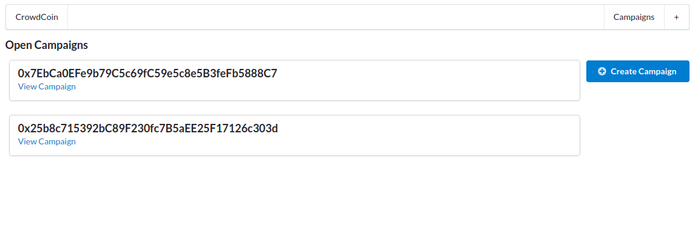
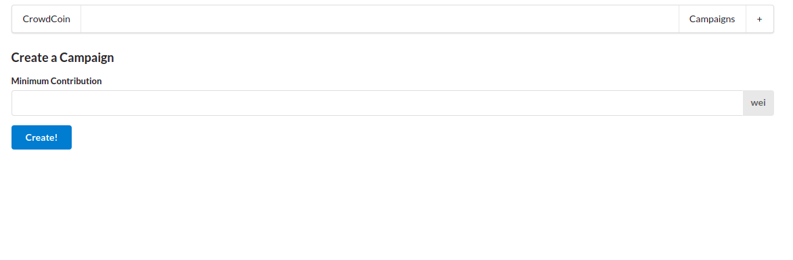
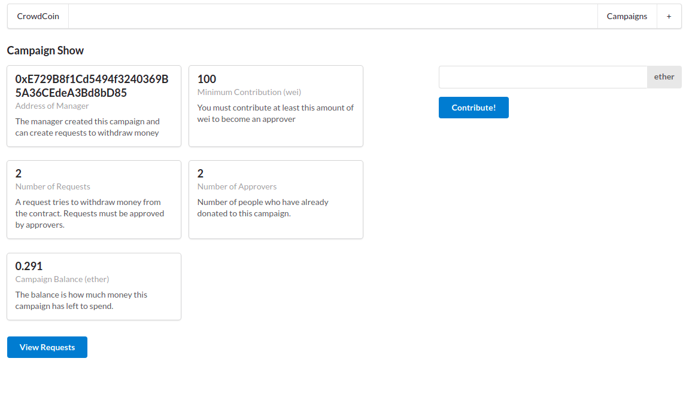
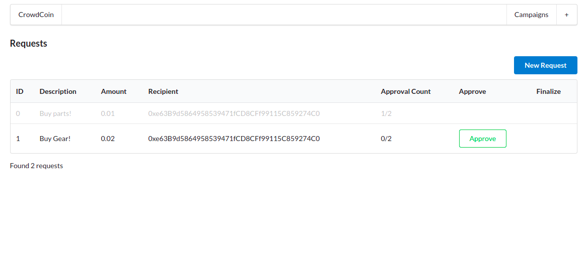
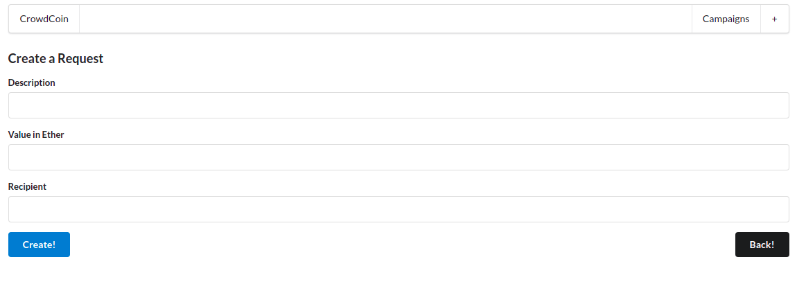

# CrowdCoin

An dapp running on ethereum network inspired on [kickstarter](https://www.kickstarter.com/?ref=nav) crowd funding system.

## Available commands

### Compile

Compiles the project generating the abi and the bytecode.

```bash
$ yarn compile
```

### Deploy

Deploys the project and create a file with the respective address

```bash
$ yarn deploy
```

> **_NOTE:_** You must replace your mnemonic phrase and infura link directly on the file. Since the environment variables are not configured.

### Test

Runs the mocha tests for the smart contracts.

```bash
$ yarn test
```

### Development server

Starts the development server.

```bash
$ yarn dev
```

## Getting Started

1. Compile and deploy the contract on Rinkeby test network
2. Rename the next.config.example file to `next.config.js` and replace the content with your environment variables.
3. Run the development server

## Overview

### Root Page - Campaigns List



### Create Campaign Page



### Campaign Details Page



### Requests List



### New Request Form



## License

[MIT](https://choosealicense.com/licenses/mit/)
